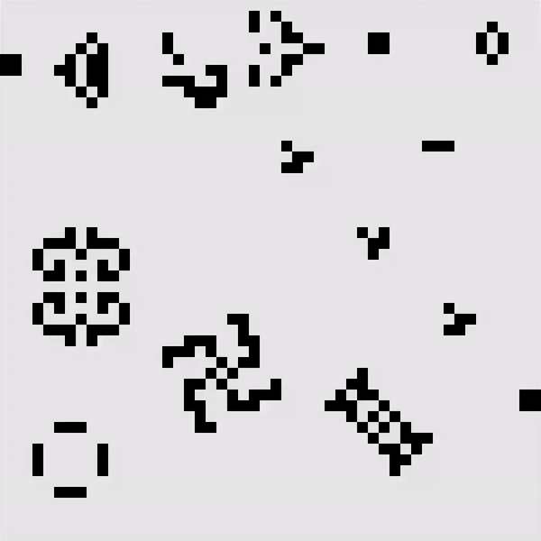

# <ins>Conway's Game of Life</ins>

#### <ins>About this project</ins>

This project is an implementation of Conway's Game of Life in Haskell. The Game of Life is a cellular automaton that operates on an infinite two-dimensional grid of square cells. Each cell is in one of two possible states, alive or dead. The state of each cell changes in discrete time steps, depending on the states of its eight neighbors according to a fixed [set of rules](https://en.wikipedia.org/wiki/Conway%27s_Game_of_Life). The rules are as follows:
1. Any live cell with fewer than two live neighbors dies, as if by underpopulation.
2. Any live cell with two or three live neighbors lives on to the next generation.
3. Any live cell with more than three live neighbors dies, as if by overpopulation.
4. Any dead cell with exactly three live neighbors becomes a live cell, as if by reproduction.

The project was developed as part of my studies for the "Functional Programming" module. It serves as a practical application of the concepts of functional programming and demonstrates the power of Haskell in the processing of data and the implementation of complex logic.

#### <ins>Example</ins>



#### <ins>Features</ins>
- Interactive marking of cells as alive or dead before starting the simulation
- Start/stop the simulation by touching the space bar
- Simulation of the life cycle based on the rules of Conway's Game of Life

#### <ins>Prerequisites</ins>

The following software/tools are required to run this project:

- [Glasgow Haskell Compiler (GHC)](https://www.haskell.org/ghc/)
- [The Haskell Tool Stack](https://docs.haskellstack.org/en/stable/README/)

#### <ins>Execution</ins>

1. Clone the repository or download the source code.
2. Open a terminal and navigate to the project directory.
3. Execute the following command to build the project:
```
stack build
```
4. Start the program with:
```
stack exec Game-of-Life-exe
```
